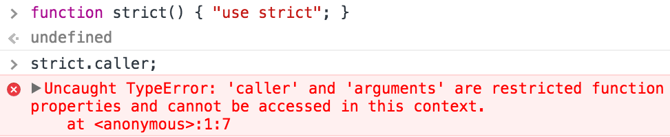
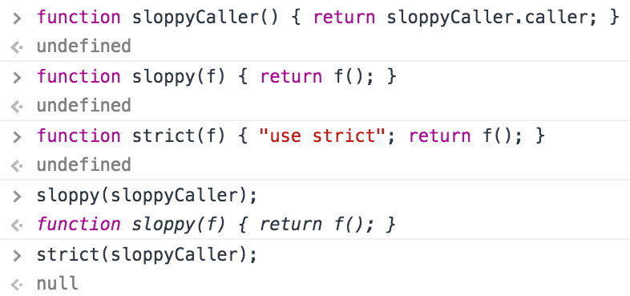

# `function.caller` considered harmful

由于历史的原因，许多 JavaScript 引擎中对于 Function 的实现，提供特殊的 `caller` 属性，用于获取调用当前函数的最近父级函数。
这一特殊属性导致了各种各样的问题：首先，可能因跨域调用而引入安全隐患；其次，这一特性的实现会导致 JavaScript 引擎执行效率降低、难于维护和测试；
更有甚者，实现这一特性将导致 `escape analysis`, `inlining`, `scalar replacement of closures` 这一些列优化策略完全失效。

`function.caller` 这一特性只存在普通函数，严格模式下的函数不允许访问 `caller` 属性，严格模式访问 `caller` 属性直接抛出异常。如下：

当前 EcmaScript 规范对 Function 对象的 `caller` 属性没有给出具体的实现说明：

> If an implementation extends non-strict or built-in function objects with an own property named “caller”
> the value of that property, as observed using [[Get]] or [[GetOwnProperty]], must not be a strict function object.
> If it is an accessor property, the function that is the value of the property’s [[Get]] attribute 
> must never return a strict function when called.

除了规定 `caller` 不能是严格模式的 Function 对象，其他的完全任由 JavaScript 引擎开发人员自主实现。

## V8 实现(Chrome, Node.js)

代码中调用 `foo.caller` 时，V8 处理过程如下：

- V8 引擎监测最新的 foo 实例，此时 foo 实例尚未退出执行

- 如果没有找到 foo 实例，直接返回 `null`

- 找到 foo 实例之后，进一步查找 foo 实例最近的父级函数

- 如果没有找到父级函数，返回 `null`

- 如果父级函数属于严格模式的 Function，或者父级函数来自不同的执行域，返回 `null`

- 返回 foo 实例最近的父级函数

**强烈建议开发过程中避免使用 `caller` 特性**