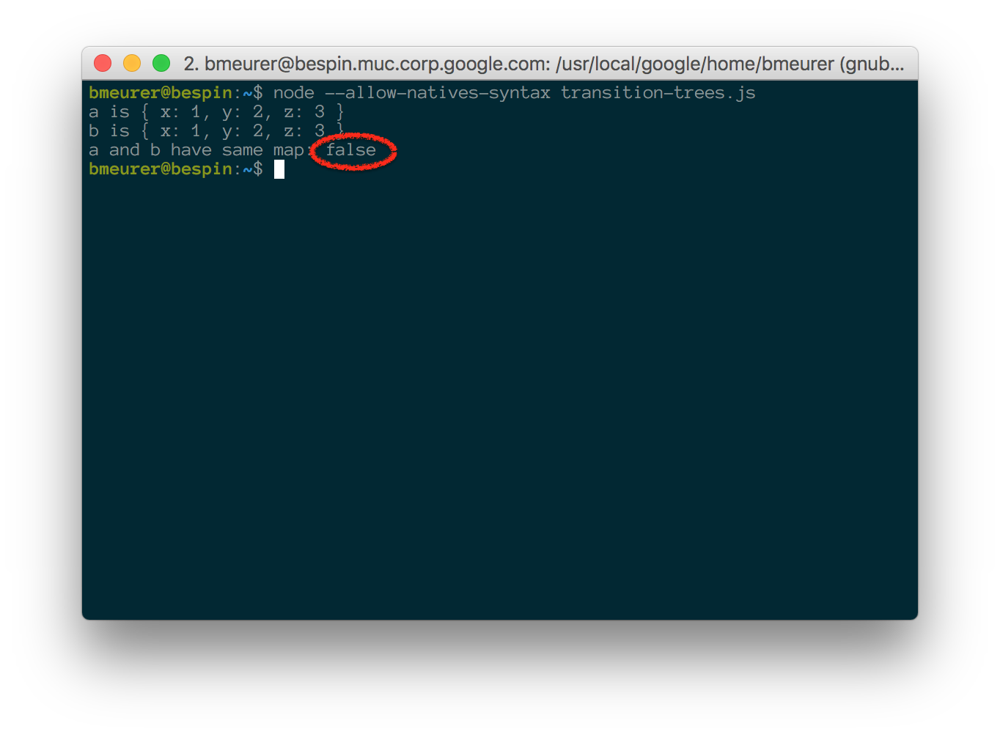
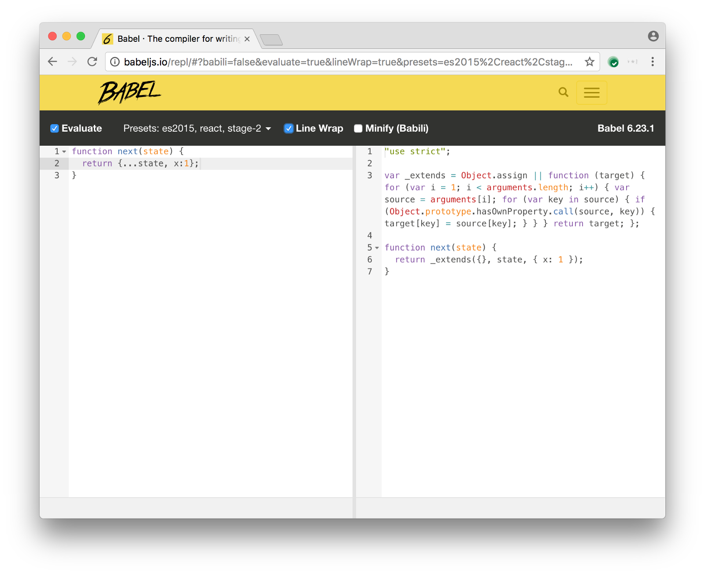

# 对象字面量中的多态

V8 在处理对象字面量的时候，针对字面量表达式，如：{ a: 1, b: 2, c: 3, ... }，V8 直接定义一个根级
[`hidden classes tree`](https://github.com/v8/v8/wiki/Design%20Elements#fast-property-access) 与之对应。

```js
let a = { x: 1, y: 2, z: 3 };

let b = {};
b.x = 1;
b.y = 2;
b.z = 3;

console.log("a is", a);
console.log("b is", b);
console.log("a and b have same map:", %HaveSameMap(a, b));
```

node 开启 `--allow-natives-syntax` 选项执行上述代码，结果如下：



尽管对象 a/b 结构一致，含相同的属性值，相同的顺序，然而其对应的 `hidden classes tree` 却各不相同。


`Object.assign` 方法、ECMAScript 6 中的 `Spread Properties` 操作，存在相同问题：

```
let a = { x: 1, y: 2, z: 3 };

let b = Object.assign({}, a);

console.log("a is", a);
console.log("b is", b);
console.log("a and b have same map:", %HaveSameMap(a, b));
```




因此，开发过程中，为充分复用 `hidden classes tree` 结构，请确保 `Object.assign` 方法始终从空对象字面量 `{}` 开始。

```js
let a = Object.assign({}, {x:1, y:2, z:3});

let b = Object.assign({}, a);

console.log("a is", a);
console.log("b is", b);
console.log("a and b have same map:", %HaveSameMap(a, b));
```

使用 `Object.assign` 方法可以确保相同的对象复用同一份 `hidden classes tree`，然而在 Redux 此类状态管理的场景中，可能触发性能问题。
因此，开发过程中请仔细斟酌选择使用。

https://medium.com/@bmeurer/surprising-polymorphism-in-react-applications-63015b50abc


