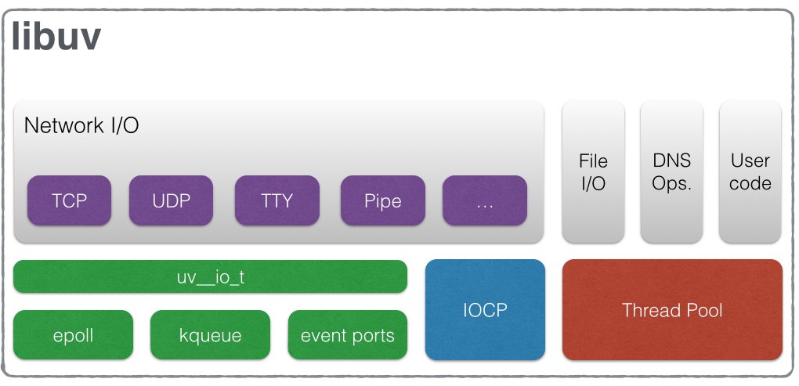

# `libuv` Design overview

`libuv` 最早是专门为 NodeJS 开发的一个基础库，实现事件驱动的异步 I/O 操作。目前已实现跨平台支持。

`libuv` 不仅实现了对系统 I/O 轮询机制的封装，还提供了 `handlers` 和 `streams` 两类抽象接口，
用于处理 socket 及其他操作实体，以及文件 I/O 操作和线程相关功能函数。

下图是 libuv 的基本组织结构图：

## handles and requests

`libuv` 提供了两种抽象结构：`handles` 和 `requests`，与 `event loop` 结合使用。

`handles` 一般是常驻对象，用于响应特定的事件，执行事件处理回调。特定事件发生时，事件对应的 `handles` 被调用执行。

`requests` 一般是指某一个具体的行为。

> Requests represent (typically) short-lived operations. 
> These operations can be performed over a handle: write requests are used to write data on a handle; 
> or standalone: getaddrinfo requests don’t need a handle they run directly on the loop.

## The I/O loop

`The I/O (or event) loop` 是 libuv 的核心部分，为所有的 I/O 操作提供执行环境，每一个 event loop 都是以单线程运行。
当然，也可以同时运行多个 libuv 实例，但是必须保证每个 libuv 实例都运行在单独的线程中。一般情况下，除非有特殊说明，`The I/O (or event) loop` 模型都是非线程安全的。

`event loop` 实现的单线程异步 I/O 机制非常简单：所有的 I/O 操作都执行在非阻塞模式下，采用系统内置的轮询机制（`epoll` on Linux,
`kqueue` on OSX and other BSDs, `event ports` on SunOS and `IOCP` on Windows）。在 `event loop` 轮转中的特定时期，
执行流程会阻塞等待，直到 I/O 操作对应的事件出现，立即处理接收到的事件并执行对应操作。

下图是 event loop 轮询执行流程：

1. event loop 记录本次轮转的起始时间 `now`，用于优化与时间相关的系统调用

2. 根据 event loop 状态，`alive` 则继续执行轮转，否则退出执行（If a loop has active and ref’d handles, 
active requests or closing handles it’s considered to be `alive`）

3. 执行到期的时钟任务

4. 执行 `pending callbacks`。绝大多数情况下，I/O 操作对应的回调函数会在 I/O 轮询到达之后立即被执行，但也存在例外情况，即 I/O 操作回调推迟到下一个
loop 中执行，也就是 `pending callbacks`，会在下一次轮转中的这一阶段被执行。

5. 执行 `idle handle callbacks`

6. 执行 `prepare handle callbacks`

7. 进入 I/O 轮询前，计算 polling 阻塞的 timeout 时间，计算方式如下：

>     * If the loop was run with the UV_RUN_NOWAIT flag, the timeout is 0.
>     * If the loop is going to be stopped (uv_stop() was called), the timeout is 0.
>     * If there are no active handles or requests, the timeout is 0.
>     * If there are any idle handles active, the timeout is 0.
>     * If there are any handles pending to be closed, the timeout is 0.
>     * If none of the above cases matches, the timeout of the closest timer is taken, or if there are no active timers, infinity.

8. I/O 轮询阻塞，阻塞时间取决于前一步的计算结果。I/O 操作对应的回调当 I/O 完成之后在本阶段调用执行。

9. 执行 `check handle callbacks`

10. 执行 `close callbacks`

11. 如果 loop 以 `UV_RUN_ONCE` 方式运行，也即是单次轮转。单次轮转中可能没有任何 I/O 操作被响应，然而随着时间的流逝，
出现了新的到期的时钟任务，新的到期的时钟任务将在此处被调用执行

12. 单次轮转结束。如果轮转以 `UV_RUN_NOWAIT` 或 `UV_RUN_ONCE` 模式运行，退出轮转，如果轮转以 `UV_RUN_DEFAULT` 模式运行，继续下一次 loop

**_`libuv` 中的文件 I/O 操作使用了线程池，而网络 I/O 操作都是单线程_**

## File I/O

libuv 中的异步文件 I/O 操作是通过线程池实现的。实现详情可参考[链接](http://blog.libtorrent.org/2012/10/asynchronous-disk-io/)

libuv 中的线程池是全局的，每次 loop 都共用同一线程池。目前有三种操作使用了线程池：

1. 文件操作

2. DNS 操作 ( `getaddrinfo` and `getnameinfo` )

3. 用户通过 `uv_queue_work()` 指定的任务

