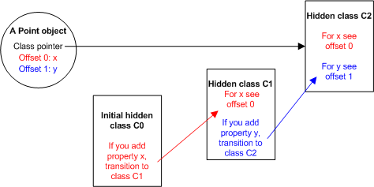

# V8 Design Elements

上世纪90年代中期，JavaScript 首次应用在网景公司的 Netscape Navigator 浏览器，JavaScript 的到来使得 web
开发者可以十分方便地操作 HTML 元素（比如：表单、frames、图片）。JavaScript 越来越多地被用来实现动态网页效果。
到90年代后期，大部分 JavaScript 脚本主要用来响应用户鼠标操作，实现图片的简单切换。

后来，随着 AJAX 的兴起，JavaScript 逐渐成了实现 web 应用的核心技术，比如：谷歌公司的 GMail。JavaScript
代码的复杂度直线上升，从最初的数行代码变为数百 KB。一方面，JavaScript 确实非常适合作为 web 应用的开发语言，
另一方面，JavaScript 的执行性能成了制约开发大型复杂 web 应用系统的关键因素。

V8 是一个新的 JavaScript 引擎，主要用于解析执行大型 web 应用。充分的 benchmark 显示，V8 引擎的执行速度比现行主流
JS 引擎快数倍（包括：IE浏览器的 JScript、火狐浏览的 SpiderMonkey，以及 Safari 浏览器的 JavaScriptCore）。
如果您的 web 应用正受限于 JavaScript 执行速度的影响，推荐您换成 V8 引擎，将能极大提升系统的性能。当然，具体能提升多少，
取决于系统 JavaScript 的复杂度，以及执行场景。使用 V8 引擎，针对 JavaScript 被反复执行的场景，优化效果将会明显优于
JavaScript 单次执行的场景。

V8 实现高性能的三个关键特性如下：

1. Fast Property Access

2. Dynamic Machine Code Generation

3. Efficient Garbage Collection

## Fast Property Access

JavaScript 是一种动态编程语言：运行时可以随时向 Object 数据中添加新的属性，也可以随时将 Object 对象中的属性删除。也即是
Object 的属性值是随时可变的。大多数 JavaScript 引擎使用类似字典的数据结构来存储 Object 的属性值。Object 中每次属性操作
都需要动态查询字典进而获得属性在内存中的位置。相较于 JAVA、Smalltalk 的实现方式，JavaScript 的实现方式的访问性能是非常缓慢的。
针对 JAVA 和 Smalltalk，因为 class 的结构是固定已知的，编译器编译过程中，instance 的各个属性值位置就已经固定下来。因此
instance 的属性值就不涉及查询，一个操作指令即可完成。

为了降低 JavaScript 中 Object 属性值的访问时间，V8 引擎抛弃了动态字典查询的实现机制。而是借鉴了同样是 prototype-based
编程语言 Self 的实现机制（[参考](http://research.sun.com/self/papers/implementation.html)），V8 在 Object
属性值的访问过程中，自动创建 `hidden classes`，Object 新增属性值时，对应的 `hidden classes` 随之改变。

为了更为清晰说明 V8 的实现，来看如下代码：

```js
function Point(x, y) {
  this.x = x;
  this.y = y;
}
```

执行 `new Point(x, y)` 创建新的 Point 对象，V8 为 Point 对象创建初始化的 hidden class，用 `C0` 表示，此时 Point
对象没有定义任何属性，C0 为空。


随即执行 Point 构造函数中的第一条语句 `this.x = x` 创建新的属性值 `x`，V8 执行：

在 C0 的基础上创建新的 hidden class，名为 C1，C1 中包含 Point 对象 `x` 属性的相关信息，`x` 属性值存放在 Point 对象 offset 0 的位置。
将 Point 对象的 hidden class 由 C0 变成 C1。


继续执行 Point 构造函数中的第二条语句 `this.y = y` 创建新的属性值 `y`，V8 执行：

在 C1 的基础上创建新的 hidden class，名为 C2，C1 中包含 Point 对象 `y` 属性的相关信息，`y` 属性值存放在 Point 对象 offset 1 的位置。
将 Point 对象的 hidden class 由 C1 变成 C2。



咋一看，上述机制略显复杂，Object 对象中每次新增属性值，都要重新创建 hidden class，实现上并不见得能够提升对象属性的访问效率。深入思考一下，
新创建的 hidden class 结构是可以多次复用的，针对同一类型的 Object 对象，初次创建的时候需要构建 hidden class 结构，后面再创建相同的 Object
实例，就可以直接复用之前的 hidden class 结构。第二次创建 Point 对象时：

* 初始化 Point 对象，对象不包含任何属性值，hidden class 指向 C0

* Point 对象添加 `x` 属性，hidden class 由 C0 变为 C1，并将 `x` 属性值写入 C1 指定的 offset 0 位置

* Point 对象添加 `y` 属性，hidden class 由 C1 变为 C2，并将 `y` 属性值写入 C2 指定的 offset 1 位置

相较于绝大多数面向对象的编程语言，JavaScript 以支持灵活的动态类型著称。有充分的实际运行数据显示，绝大部分 JavaScript 应用种，存在很大比例的执行
cases 都符合上述共享数据结构的模型。

使用 hidden class 机制带了两个好处：

1. Object 对象中访问属性值不需要查询字典，直接定位属性值

2. V8 可以充分利用经典的 class-based 优化方法，`inline caching` 优化执行

更多信息可参考 [Efficient Implementation of the Smalltalk-80 System](http://portal.acm.org/citation.cfm?id=800017.800542)

## Dynamic Machine Code Generation

V8 引擎在首次执行 JavaScript 代码时直接将其编译成机器码执行。没有中间码，也没有解释器。V8 执行时，会对使用 `inline cache` 优化过的 Object 属性访问代码进行校正。

在访问给定对象的属性之前，V8 首先确定了当前对象的 hidden class。利用局部访问原理，V8 引擎假定在当前代码段中，后续所有的 Object 属性访问都使用相同的 hidden class，
也即是已经确定了的 hidden class。使用此 hidden class 中的信息对 `inline cache` 优化过的属性访问代码进行优化。如果预测成功，直接操作 Object 的属性值，如果预测失败，
执行 `inline cache` 优化前的流程。

比如：JavaScript 访问 Point 对象中的 `x` 属性：

```js
point.x
```

V8 生成的机器码如下：

```assembly
# ebx = the point object
cmp [ebx,<hidden class offset>],<cached hidden class>
jne <inline cache miss>
mov eax,[ebx, <cached x offset>]
```

