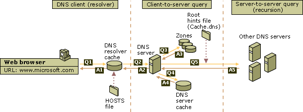
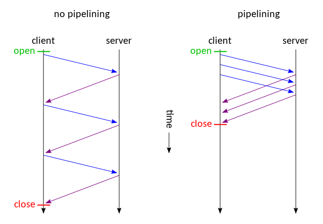

# Web性能优化 #
- 写在最前面
- dns解析
- http/1.0
- http/1.1
- http/2
- 浏览器渲染模型

## 写在最前面 ##

理解Web各个环节的实现原理，才能有效实施性能优化策略。

## dns解析 ##

应用层http协议使用域名标识Web服务，而网络传输过程中实际上是使用ip地址来标识通信的两端，因此，访问Web服务的第一步是做dns解析，将Web服务器的域名解析成对应的ip地址。如下（windows平台）：

*如能提前执行dns解析，用户请求Web资源时就能够节省dns解析的时间延迟，这就是dns预取策略。*

<https://developer.mozilla.org/zh-CN/docs/Controlling_DNS_prefetching>

## http/1.0 ##

http协议是Web应用的基础，http协议目前有三个版本：http/1.0、http/1.1、http/2。首先需要理解各个版本的特点，先从http/1.0开始。

http协议使用tcp来实现可靠的数据传输，在http/1.0中，一次http请求对应一个tcp连接，用户通过浏览器发送http request，Web服务器返回http response数据，数据传输完成之后即断开tcp连接。这里引入两个问题：

    1. tcp连接不可复用，导致重复建立连接的开销
    2. Web服务器主动关闭tcp连接，维护大量TIME_WAIT状态

另，http/1.0规范中，request头部字段缺乏Host字段的定义，无法识别一台主机中的不同域名。

<https://www.w3.org/Protocols/HTTP/1.0/HTTPPerformance.html>

## http/1.1 ##

首先，相较于http/1.0，http/1.1支持tcp持久连接，默认情况下，同域下的多个http请求共用同一个tcp连接。 
其次，http/1.1支持pipelining，将多个request顺序提交到Web服务器，而在发送过程中不需要先等待服务端的回应，但要求Web服务器端返回response的顺序必须与request的发送顺序一致，这里可能产生对头阻塞（Head-of-line blocking）。 
当然，http/1.1修复了http/1.0中Host头部字段缺失的问题，完善了缓存机制等。

较之于http/2，http/1.1存在如下问题：

    1. http头部字段冗余重复
    2. http/1.1中的pipelining存在对头阻塞

<http://www.kancloud.cn/digest/web-performance-http2/74816>

## http/2 ##

