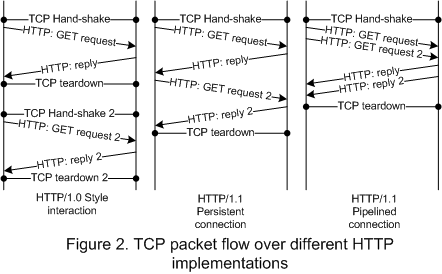

# Web性能优化 #
- 写在最前面
- dns解析
- http/1.0
- http/1.1
- http/2
- 浏览器渲染模型

## 写在最前面 ##

理解Web各个环节的实现原理，才能有效实施性能优化策略。

## dns解析 ##

应用层http协议使用域名标识Web服务，而网络传输过程中实际上是使用ip地址来标识通信的两端，因此，访问Web服务的第一步是做dns解析，将Web服务器的域名解析成对应的ip地址。如下（windows平台）：

*如能提前执行dns解析，用户请求Web资源时就能够节省dns解析的时间延迟，这就是dns预取策略。*

<https://developer.mozilla.org/zh-CN/docs/Controlling_DNS_prefetching>

## http/1.0 ##

http协议是Web应用的基础，http协议目前有三个版本：http/1.0、http/1.1、http/2。首先需要理解各个版本的特点，先从http/1.0开始。

http协议使用tcp来实现可靠的数据传输，在http/1.0中，一次http请求对应一个tcp连接，用户通过浏览器发送http request，Web服务器返回http response数据，数据传输完成之后即断开tcp连接。这里引入两个问题：

    1. tcp连接不可复用，导致重复建立连接的开销
    2. Web服务器主动关闭tcp连接，维护大量TIME_WAIT状态

另，http/1.0规范中，request头部字段缺乏Host字段的定义，无法识别一台主机中的不同域名。

<https://www.w3.org/Protocols/HTTP/1.0/HTTPPerformance.html>

## http/1.1 ##

首先，相较于http/1.0，http/1.1支持tcp持久连接，默认情况下，同域下的多个http请求共用同一个tcp连接。 
其次，http/1.1支持pipelining，将多个request顺序提交到Web服务器，而在发送过程中不需要先等待服务端的回应，但要求Web服务器端返回response的顺序必须与request的发送顺序一致，这里可能产生对头阻塞（Head-of-line blocking）。 
当然，http/1.1修复了http/1.0中Host头部字段缺失的问题，完善了缓存机制等。

较之于http/2，http/1.1存在如下问题：

    1. http/1.1中的pipelining存在对头阻塞
    2. 客户端、服务器维护多条并发tcp连接
    3. http头部信息冗余

另，rfc2616种规定使用persistent connection时，客户端（用户浏览器）对单个域名的并发连接数不超过2个，现实中不同浏览器实现各不相同。

<http://www.kancloud.cn/digest/web-performance-http2/74816>  
<http://stackoverflow.com/questions/246859/http-1-0-vs-1-1>  
<http://stackoverflow.com/questions/10480122/difference-between-http-pipeling-and-http-multiplexing-with-spdy>  
<http://stackoverflow.com/questions/10362171/is-spdy-any-different-than-http-multiplexing-over-keep-alive-connections?lq=1>

## http/2 ##

http/2是对http/1.1的升级，基本语法保持不变，主要解决http/1.1性能问题。整体上来看做了下升级：

- 字节流传输代替字符流

- 一个tcp链接中多路复用

- 头部压缩降低冗余

- 请求资源优先级设定

- 服务器端<b>推送</b>服务

整体来讲，http/2较之于http/1.1，性能上实现大幅提升。升级http/2时，针对http/1.1的优化策略需调整（如：域名拆分）。

## 浏览器渲染模型 ##

1. 渲染引擎生成DOM树、CSS树

2. 合并DOM树、CSS树，生成render树（必须是展现节点）

3. 布局计算每个对象的精确位置及尺寸

4. 绘制，输入确定的渲染树，在屏幕上渲染像素

JavaScript解析执行将阻塞页面渲染，这是因为JavaScript执行可能改变DOM结构、CSS样式，如并行渲染页面，将导致不一致。

<https://developers.google.com/web/fundamentals/performance/critical-rendering-path/render-tree-construction?hl=en>

<http://www.html5rocks.com/zh/tutorials/internals/howbrowserswork/>
